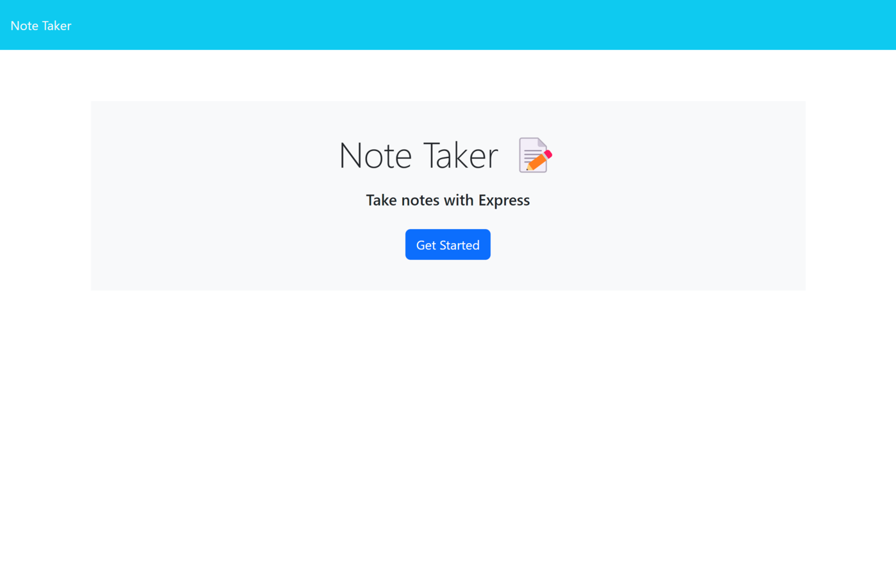
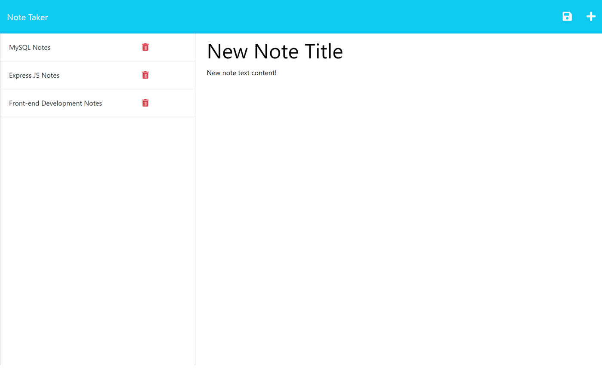

# Zain Gova - Note Taker App

## Description

This is a appliation that allows a user to write and save notes. The user can leave the page and return, and the notes will remain because the data is read from and written to a JSON file. The user can also delete previously-saved notes by clicking on the 'delete' icon. The front-end was already written so I took care of all the back end code, which was done using Express JS. 

## Visuals

## Usage

[Click here to see the deployed app on Heroku](https://zain-gova-note-taker-app.herokuapp.com/)

Upon deployment, the app takes the user to a landing page. If any invalid url parameters are typed into the search bar, the user will be redirected to this page. After clicking on the 'Get Started' button, the user will be able to enter a new note. Once a title and text body are entered, a 'save' icon in the nav bar will appear, which the user can click on to save their note. All saved notes will appear on the left side of the page, and te user can click on them to pull up the title and text associated. If the user wishes to delete a note, they can click on the 'delete' icon on the right side of the note to do so. As mentioned in the description at the start of this README, all data is saved to a JSON file so leaving the page or refreshing it won't cause the user to lose their notes.

## License

This project uses the MIT Licence. Click the badge at the top of this README for more information.